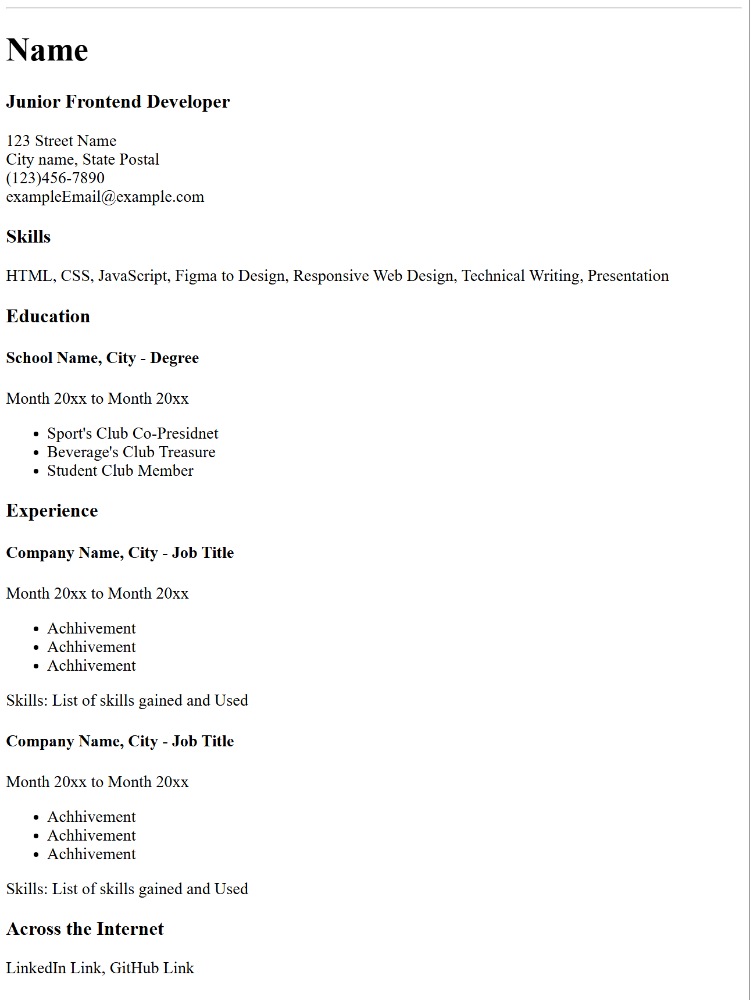

# Single-Page CV
This is a generic sinle page CV for a student.

# Link to Roadmap.sh
https://roadmap.sh/projects/single-page-cv

# Learning Objective
The object of this project was to learn about semantic HTML,
SEO tags, Open Graph Tags, and Favicon.  

# Challenges
The only challenge was the favicon. I did not know what it was
and it only required a little bit of research to find out what
it was. The small icon on webpages.

# Tech Stack
HTML

# Screenshot
This is the CV
### CV

